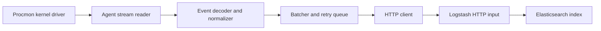

# Procmon XP 32-bit streaming agent to ELK (Logstash HTTP input)

## Goal
Build a 32-bit Windows XP agent that reads Process Monitor live events from the Procmon driver/device stream (no dependency on a backing PML file) and ships events to Logstash HTTP input in near real time.

## Assumptions and constraints
- Target OS: Windows XP 32-bit.
- Procmon provides a live driver/device stream that can be opened by a user-mode client.
- Logstash HTTP input requires no auth and accepts JSON events.
- The agent can launch or otherwise ensure `[procmon.exe](procmon.exe)` loads its driver but does not rely on PML output.

## Architecture overview

## Implementation plan with tooling and commands

### 1) Toolchain and build setup (XP 32-bit)
- Use Visual Studio 2008 SP1 or Visual Studio 2010 with Windows 7.1 SDK to produce XP-compatible binaries.
- Compile with `Subsystem: Windows, version 5.01` and `/MT` if you want to avoid runtime dependency drift.
- Build commands (example):
  - `msbuild Agent.sln /p:Configuration=Release /p:Platform=Win32`

### 2) Procmon-agnostic device name discovery
Goal: identify the live stream device name without assuming a Procmon version.

Primary user-mode workflow (preferred):
- Start Procmon silently to ensure the driver is loaded (EULA accepted once):
  - `Procmon /AcceptEula /Quiet /Minimized`
- Enumerate device handles opened by Procmon:
  - `handle.exe -a procmon`
  - Look for handles of type `File` pointing to `\\Device\\...` or `\\.\\...` targets.
- Correlate with device symbolic links:
  - Use `WinObj` or `QueryDosDevice` enumeration to map `\\Device\\X` to a `\\.\\X` user-visible link.
- Extract potential device strings from the Procmon binary:
  - `strings.exe Procmon | findstr /i procm` (capture any `\\.\\` or `\\Device\\` patterns).
- Validate candidate names by attempting `CreateFile` in a small harness and checking `GetLastError`.

Fallback options (optional):
- Enumerate device objects by scanning `\\.\\` namespace (attempt `CreateFile` on candidates derived from strings).
- If Procmon is not running, start it and re-run handle enumeration to detect new device objects.

Deliverable: a table of candidate device names and a verified open handle from a minimal harness.

### 3) IOCTL handshake discovery and replay
Goal: capture the IOCTL sequence needed to start/stop streaming and configure filters.

User-mode capture workflow (preferred):
- Use API monitoring or debugger breakpoints on `DeviceIoControl` in the Procmon process to log:
  - Control codes (IOCTL numbers)
  - In/out buffer sizes and contents (hex dumps)
  - Call order and frequency
- Correlate the IOCTL sequence with UI actions (start/stop capture, clear, filter changes).
- Distinguish one-time handshake IOCTLs (version negotiation, capability query) from streaming control.

Replay workflow in a harness:
- Open the device with the same access/flags as Procmon.
- Replay IOCTLs in the observed order with captured buffers.
- Confirm that a successful sequence yields readable event blobs via `ReadFile` or `DeviceIoControl` output buffers.

Optional kernel-tracing fallback:
- Attach a kernel debugger to break on the driver `IRP_MJ_DEVICE_CONTROL` handler and log control codes and buffer pointers.
- Use driver logging (DbgPrint) if available to infer request structure and responses.

Deliverable: an IOCTL handshake recipe including control codes, buffer sizes, and success criteria.

### 4) Event blob schema reverse-engineering workflow
Goal: decode the raw event blobs into structured events without a public schema.

Capture strategy:
- After handshake, read and persist raw event blobs to disk with metadata:
  - Capture timestamp, blob length, and sequence index per read.
- Generate controlled workloads while Procmon UI is visible:
  - File create/delete, registry set, process start, network connect.
- Export Procmon UI events for the same time window (CSV or XML) to use as ground truth.

Schema inference workflow:
- Identify record boundaries by looking for repeating headers or length fields.
- Use differential tests: compare blobs before/after a single known action to isolate fields.
- Locate ASCII/Unicode strings in blobs (paths, process names) to anchor offsets.
- Infer common fields: timestamp, PID/TID, event class, result/status, detail string.
- Build a versioned schema map keyed by a driver or handshake version field (if exposed), or by a hash of the initial header bytes.

Normalization plan (Logstash HTTP input, no auth):
- Produce JSON per event with ECS-aligned fields where possible:
  - `@timestamp`, `event.action`, `event.category`, `process.pid`, `process.name`, `file.path`, `registry.key`, `network.*`, `result`, `message`.
- Preserve raw fields in `labels` or `procmon.raw_*` for unknown/experimental offsets.

Deliverable: documented field map with offsets, types, and validation notes per schema version.

### 5) Agent core (32-bit service)
- Build a Windows service that:
  - Ensures Procmon driver is loaded (launch `[procmon.exe](procmon.exe)` or load driver via SCM if supported).
  - Opens `\\.\PROCMONxx` device and reads the event stream.
  - Decodes and normalizes events.
  - Writes to an in-memory queue and disk-backed spool for resilience.

Service install example:
- `[sc.exe](sc.exe) create ProcmonStreamAgent binPath= "C:\Program Files\ProcmonAgent\agent.exe" start= auto`
- `[sc.exe](sc.exe) start ProcmonStreamAgent`

### 6) Shipping to Logstash HTTP input
- Batcher groups events by size/time threshold (e.g., 200 events or 2 seconds).
- HTTP client posts to `http://logstash-host:port/` with `Content-Type: application/json`.
- Retry with exponential backoff, spool to disk on sustained failures.

### 7) Validation and decoding correctness
Validation criteria:
- Event count parity between stream and Procmon UI exports for the same time window.
- Correct mapping of action/type fields for controlled workloads.
- Sequence monotonicity (if sequence ID exists) and gap detection.
- Timestamp alignment within acceptable drift.

Validation workflow:
- Run a scripted workload while capturing blobs and Procmon UI export.
- Decode blobs to JSON and compare with UI export using a diff script (counts, key fields).
- For each event class, verify at least one sample with full field mapping.
- Validate ingestion by posting decoded events to Logstash HTTP input and confirming indexing.

Deliverable: a validation checklist and a set of sample decoded events with matched UI records.

### 8) Packaging and deployment
- Package `[procmon.exe](procmon.exe)` alongside agent if licensing allows.
- Include config file for Logstash URL, batching thresholds, and spool path.
- Provide install/uninstall scripts using `[sc.exe](sc.exe)`.

## Risks and mitigations
- **Undocumented driver interface**: capture and replay IOCTLs in a harness before integrating into the agent.
- **Version drift**: maintain a schema version map and auto-detect based on handshake/header signatures.
- **Access/permissions**: require admin privileges or service account with driver access; document prerequisites.
- **Stream backpressure**: implement read loop with batching and drop policy if buffers overflow.
- **XP limitations**: avoid modern TLS; keep HTTP-only or use a proxy on the network edge.
- **Procmon UI dependency**: plan for a minimal mode where Procmon is launched headless solely to load the driver.

## Open items for implementation mode
- Exact device name(s) observed in target environment.
- IOCTL handshake sequence and buffer layouts.
- Event blob schema mapping and version detection rules.
- Logstash HTTP input payload format constraints.

## Repo context mapping
- Plan basis: `[plans/procmon-elk-plan.md](plans/procmon-elk-plan.md:1)`.
- Streaming reader placeholder: `[main.cpp](procmon-agent/src/main.cpp:17)`.
- HTTP sender: `[http_sender.cpp](procmon-agent/src/http_sender.cpp:1)`.
